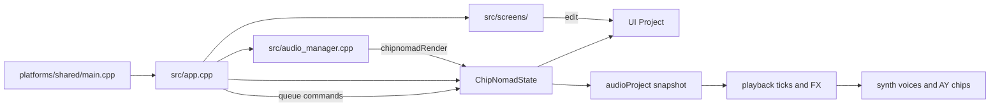

# Core app architecture

Read this before changing the project model, sequencer, instrument catalogue,
save/load, module boundaries, or anything that crosses the UI/audio split.

## Source of truth

| Concern | Files |
| --- | --- |
| App loop | `tracker/platforms/shared/main.cpp`, `tracker/src/app.cpp`, `tracker/src/app.h` |
| Settings / paths | `tracker/src/common.h`, `tracker/src/common.cpp` |
| Engine state | `chipnomad_lib/chipnomad_lib.h`, `chipnomad_lib/chipnomad_lib.cpp` |
| Project | `chipnomad_lib/project.h`, `chipnomad_lib/project.cpp`, `chipnomad_lib/project_constants.h` |
| Instruments | `chipnomad_lib/project_instruments.h`, `chipnomad_lib/project_instruments.cpp` |
| Sequencer | `chipnomad_lib/playback.h`, `chipnomad_lib/playback.cpp`, `chipnomad_lib/playback_fx*.cpp` |
| Audio device glue | `tracker/src/audio_manager.cpp` |
| Screens | `tracker/src/screens/` |
| Platforms | `tracker/platforms/` |

## Mental model

ChooChooTracker is one C++ tracker with two owners:

```text
tracker/          application, screens, SDL, files, packaging
chipnomad_lib/    project, sequencer, voices, chips, export
```



The UI thread owns `ChipNomadState::project`. The audio callback owns
`playbackState`, voices, mix buffers, and a snapshot called `audioProject`.
Edits become audible on the next sequencer tick, not immediately.

## Startup

`main` loads settings, optional custom font, graphics, then `appSetup()`:

1. Default key mapping if settings had none.
2. `chipnomadCreate()`.
3. Load `autosave.cct`, else bundled `projects/grieg-mountain-king-fm.cct`,
   else empty AY project.
4. `screensInitAll()`, `playbackInit()`.
5. `chipnomadInitChips(sampleRate)`, quality and Braids settings.
6. `audioManager.start(sampleRate, bufferSize)` and resume.
7. Title screen.

Shutdown: `audioManager.stop()` then `chipnomadDestroy()`.

## ChipNomadState

Allocated with `malloc`. C++ voice objects are heap pointers, not embedded
members. Destroy paths must `delete` voices and free sample buffers.

Important fields:

- `project` / `audioProject`
- `playbackState`
- `chips[PROJECT_MAX_TRACKS]` (AY, one per track)
- `braidsVoices`, `sampleVoices`, `scwfVoices`, `plaitsVoices`,
  `plaitsAltVoices`, `achchidVoices`, `drumSynthVoices`, `mmeVoices`,
  `sinteredVoices`
- `masterEffects`
- `audioCommands`
- mix / reverb / delay buffers reserved before the device starts
- `uiPlaybackStatus` published for screens

`ChipNomadState` is the process singleton via `chipnomadState` in `common.h`.

## Real-time boundary

Rules (also in `docs/realtime-architecture.md`):

1. Audio never edits `project`. Motion record emits events; UI writes FX cells.
2. Audio never allocates, opens files, or locks.
3. UI publishes a project snapshot through three fixed slots.
4. At a tick, audio adopts the newest snapshot, then coalesced settings, then
   FIFO transport commands.
5. `Stop` is an atomic priority request. Play / preview / phrase queue are
   FIFO. Loop, mute/solo, sticks, project refresh: latest value wins.
6. Screens read `chipnomadGetPlaybackStatus()`, never mutable `PlaybackState`.
7. If a callback is larger than reserved buffers: silence excess, set overflow
   flag, do not realloc.

UI marks `audioProjectDirty` on key-down and publishes a snapshot later in the
frame path. Live stick axes are atomics, not project fields.

## Project model

Limits in `project_constants.h`:

| Item | Max |
| --- | --- |
| Tracks | 8 |
| Song rows | 256 |
| Chains | 255 |
| Phrases | 1024 |
| Grooves | 32 |
| Instruments | 128 |
| Tables | 255 |
| AY sample bytes | 16384 |

Hierarchy:

```text
Song row -> Chain -> Phrase (16 rows) -> note + instrument + volume + 3 FX
Instrument -> optional table + 4 modulation slots + engine data
```

Phrase FX: 3 columns. Table FX: 4 columns. Do not add a fourth phrase lane.

`InstrumentType` and `FX` enums are serialized. Append new values at the end.
Never reorder. Missing new fields load as safe defaults. Incompatible layout
changes need a new format version. Released `.cct` files must keep loading.

ChipNomad files are not a compatibility target. Review upstream for fixes;
reimplement, do not merge architecture rewrites. See
`docs/fork-maintenance.md`.

WAV sample data is not embedded in `.cct`. The project stores a path. Missing
samples load silent with a UI warning. Relative `samples/` paths are still
incomplete; treat paths as not portable yet.

## Instrument catalogue

`project_instruments.*` is metadata for UI, FX filtering, modulation, and
motion record. Renderers stay typed. Do not access `InstrumentChipData` with
offset reflection.

Each family declares:

- UI name, category, screen kind
- init / free
- modulation destinations and ranges
- visible FX
- destination-to-FX mapping for motion record
- whether it uses shared voice-post (filter + ADSR)

Categories in the type popup: CHIP, DRUMS, SAMPLE, SYNTH. Display order is not
the serialized `InstrumentType` order. Keep serialized IDs stable.

Shared post settings live in `InstrumentVoicePostSettings` (filter character /
mode / slope / cutoff / resonance, ADSR, envelope shape). AY families do not
use this path.

## Sequencer

`playbackNextFrame` runs on audio ticks derived from `project.tickRate`.
Grooves set per-row tick counts. `SPD` is a persistent per-track rational
clock. The scheduler advances at most one row per audio tick.

Notes trigger voices or AY registers. Instrument FX are absolute and last
until the next note trigger, which restores instrument defaults then applies
that row's FX. Modulation FX (`M1A`..`M44`) are relative and accumulate.

Conditions: `PRO` (0-100%), `MOD` (visit modulo). Conditions on one row AND.
Tables can retrigger on instrument, phrase, chain, or run free.

When adding FX: append to `enum FX`, name tables, group, instrument filter,
init/handle/restart handlers, tests. Do not reuse IDs.

## Application loop

60 FPS main loop (`tracker/platforms/sdl2/corelib_mainloop.cpp`).

Logical keys in `corelib_input.h`: Left/Right/Up/Down, Edit, Opt, Play, Shift,
MotionLive, MotionRecord, MotionErase.

`appOnEvent` maps device codes through `KeyMapping` (3 physical bindings per
logical button), handles hold/repeat internally (SDL key repeat is ignored),
then `currentScreen->onInput`. Unhandled Play goes to global transport.

Autosave every 60 seconds of frames. Autosave is storage, not project
identity: restoring `autosave.cct` keeps the last real project name.

## Platforms

Same engine, different adapters:

| Target | Makefile | Notes |
| --- | --- | --- |
| Windows | `Makefile.windows` | Dev box. Ship exe + DLLs + assets. |
| PortMaster ARM64 | `Makefile.portmaster` | Primary hardware. |
| Web | `Makefile.web` | Checked-in `web/dist/`. |
| Android | `Makefile.android` | Play listing separate. |
| Linux x86_64 | `Makefile.linux` | Steam Deck experiments. |
| RG35xx / Miyoo | `Makefile.rg35xx`, `Makefile.miyooports` | ChipNomad-era SDL1.2. Not the current product path. |

`Makefile.common` compiles tracker + chipnomad_lib + vendored DSP. Plaits-Alt
firmware UI files are excluded. Do not add Plaits `physical_modelling` to
include paths; it shadows `string.h`.

Tests: `cd tracker && make -f Makefile.test -j4`.

## How to add a subsystem

New synth family (minimum):

1. `InstrumentType` value at end of enum.
2. Struct in `InstrumentChipData`.
3. `InstrumentDefinition` (name, screen, dests, FX, init/free).
4. Voice class under `chipnomad_lib/synth/`.
5. Pointers on `ChipNomadState`, construct/destroy, update/render in
   `chipnomad_lib.cpp`.
6. Screen in `tracker/src/screens/instrument_*.cpp` using common header +
   voice-post helpers.
7. FX names appended after existing IDs.
8. Save/load fields with defaults.
9. Tests for trigger, filter, finite output, FX lifetime.
10. RG353V CPU check if the voice can run on all eight tracks with sends.

New tracker screen: see `docs/agents/UI.md`.
New PortMaster behaviour: see `docs/agents/PORTMASTER.md`.

## Design rules

- Reuse ChipNomad tracker workflow. Diverge only for product goals.
- Eight fixed monophonic tracks. No polyphony, no plugin hosts, no SD streaming.
- Silent voices skip DSP.
- Keep shared code recognizable for optional upstream cherry-picks.
- Frozen Mutable snapshots. Adapt in wrappers.

## Caveats log

### 2026-08 — ChipNomadState is malloc'd

- Symptom: embedding C++ voice objects in the state struct is unsafe
- Cause: `chipnomadCreate` uses malloc, no constructors
- Rule: store pointers; own lifetime in create/destroy
- Files: `chipnomad_lib/chipnomad_lib.cpp`
- Status: workaround

### 2026-08 — Audio must not write Project

- Symptom: saves can observe torn phrase FX during motion record
- Cause: callback and UI would mutate the same object
- Rule: motion events queue to UI; UI writes cells and dirty flag
- Files: `tracker/src/app.cpp`, `chipnomad_lib/chipnomad_lib.cpp`
- Status: fixed

### 2026-09 — Sample paths are not portable

- Symptom: a project with samples breaks on another machine or SD card layout
- Cause: `.cct` stores the source path and does not copy WAVs
- Rule: keep projects loadable if the WAV is missing; do not embed PCM in `.cct`
- Files: `chipnomad_lib/project_instruments.h` `InstrumentSample`
- Status: open
