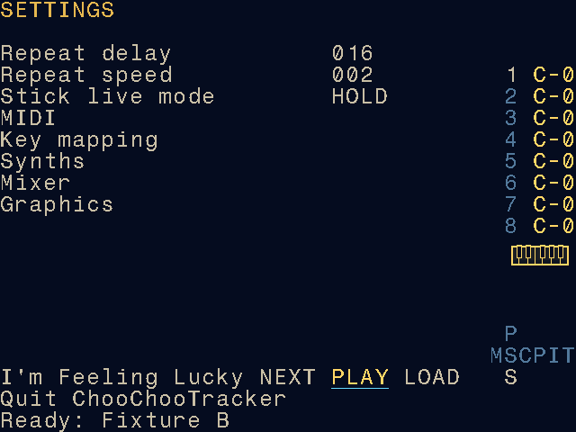

# Experimental module sample discovery

This personal-fork experiment is compiled only with
`CHOOCHOO_EXPERIMENTAL_MOD_LUCKY=1`. The default is **OFF**: no Settings row,
worker, module decoder, HTTP client or new dependency is included. It can be
integrated into the fork normally; it is not a local-only or permanent-branch
restriction. There is no runtime toggle or Experimental submenu.

## Use

One Settings row immediately above Quit:

```text
I'm Feeling Lucky NEXT PLAY LOAD
```



Production SDL capture using a self-authored test module. PLAY is selected and
ready; preparation has not started audio. This is a desktop capture, not a
handheld validation.

Use the existing logical Up/Down, Left/Right and EDIT controls. NEXT prepares
one random module. Its underline sweeps in four theme-colored brightness
steps while downloading, validating and preparing the first audio buffer.
This is an indeterminate indicator, not a percentage. PLAY and LOAD are dim
until ready. Completion moves focus to PLAY only if the user has stayed on
NEXT. Release EDIT and press it again to listen. No audio starts automatically.
PLAY uses the cached song; LOAD imports that exact song's embedded sample bank
without another request. LOAD becomes unavailable after a successful import.

NEXT replaces the candidate and stops preview. LOAD, leaving Settings, normal
tracker transport activation and application shutdown also stop preview.
Leaving during a request cancels/invalidate its completion. Re-entering Settings
does not start network or audio. Natural song end keeps the bank available;
PLAY can replay the same cached song. There is no prefetch or automatic next.
Tracker playback is stopped through its existing command mechanism before
module playback; it is not automatically resumed.

## Build

The only new native dependencies are **libxmp-lite 4.7.3** (MIT, statically
linked) and the platform's **libcurl** HTTPS development/runtime library.
Use the existing C/C++17 toolchain. SDL and the existing application dependencies
are unchanged. `scripts/build-mod-lucky-dependency.sh` downloads the tagged
libxmp source, verifies SHA-256
`b6a98797e4fb9c9a705f5d53112aa5214561857e929a644928b9e658930d9440`,
and builds only its lite static target, with depackers and ProWizard disabled.
No runtime Python, shell download chain, external player or helper is used.
The pinned source and public API are at
<https://github.com/libxmp/libxmp/tree/libxmp-4.7.3>.
The MIT notice is in `tracker/src/experimental/mod_lucky/notices/` and is copied
beside experimental desktop builds and into experimental PortMaster packages.
Keep platform libcurl/SDL notices with any runtime libraries you distribute.

From the repository root:

```sh
scripts/build-mod-lucky-dependency.sh
make -C tracker -f Makefile.test -j4
make -C tracker -f Makefile.test -j4 CHOOCHOO_EXPERIMENTAL_MOD_LUCKY=1 \
  BUILD_DIR=build/tests-mod-lucky
```

`MOD_LUCKY_ARCHIVE` may point at an already downloaded archive with that exact
checksum. `MOD_LUCKY_DEPS_DIR`, `MOD_LUCKY_PREFIX`, `CC`, `AR`, `CFLAGS` and
configure arguments allow using an existing target toolchain. The Makefile's
`MOD_LUCKY_PREFIX` is relative to `tracker`; the script's prefix should be an
absolute path. Do not reuse native libraries for an ARM build.

For the macOS environment used for this implementation, SDL2.framework was
already available and has been copied into `tracker/build/desktop/Frameworks`.
The exact personal build/launch commands are:

```sh
cd tracker
make -f Makefile.desktop desktop CHOOCHOO_EXPERIMENTAL_MOD_LUCKY=1 \
  COMMON_CFLAGS='-std=c++17 -Wall -g -Os -DTEST' \
  XTRA_CFLAGS='-Fbuild/desktop/Frameworks -DDESKTOP_BUILD -DMACOS_BUILD -DGAMEPAD_SUPPORT -D__MACOSX_CORE__' \
  XTRA_LIBS='-Fbuild/desktop/Frameworks -framework SDL2 -framework CoreMIDI -framework CoreAudio -framework CoreFoundation -lm -Wl,-rpath,@executable_path/Frameworks' \
  OUTPUT='-o build/desktop/choochootracker'
cd build/desktop
./choochootracker
```

On other configured native desktops, use the normal platform build with
`CHOOCHOO_EXPERIMENTAL_MOD_LUCKY=1`, `MOD_LUCKY_PREFIX` if needed, and the
platform's libcurl headers/library available. This experiment has not been
validated on Windows, Android or Web. Disabled builds keep their normal targets.

For an existing ARM64 PortMaster toolchain, build the dependency for that target
in a separate dependency directory, then add the same flag and ARM prefix to
`make -C tracker -f Makefile.portmaster PortMaster`. Target libcurl headers,
libcurl, its TLS backend and a valid CA trust store must exist in that toolchain
and on the handheld. There is no insecure TLS fallback. The isolated R36H build
and automated device checks below succeeded. Installing over the working
handheld application requires explicit approval; the personal Alpha installation
record below documents the user's subsequent approval and completed update.

## Import, tuning and persistence

Only normal PCM Sample instruments are created, one per nonempty source sample
slot. Patterns, source multisample mappings, envelopes, effects, arrangement,
project title, tempo, mixer and existing instruments/tables remain unchanged.
All phrases are checked for references, including unused phrases. An instrument
must exactly match a freshly initialized empty instrument and its corresponding
default table must be empty. Configured but unreferenced instruments are protected.
Slots are deterministic and ascending. The complete bank must fit.

Staging writes assets and loads normal instrument definitions on the worker.
Before commit, the entire project snapshot and request/project session are
rechecked. Commit pauses audio briefly, transfers ownership without a fallible
allocation/write, and marks the project modified only on success. Failed or
cancelled staging removes only that attempt's newly created bank directory.

Durable assets use the configured **sample root**:

```text
<sample-root>/mod_lucky/<module-id>-<fnv1a64>-<unique-suffix>/
  s000.wav ...
  source.json
  source-page.html
```

Names are generated locally, never from remote filenames. Existing directories
are never overwritten. The source record maps original slots to destination
instruments and preserves full names, title, format, original filename, download
UTC timestamp, module comments/credits, reference rate, transpose/finetune,
original loop positions/types and fidelity limitations. The source page is
retained verbatim, including any supplied credits/licensing text. No permissions
are inferred. FNV-1a64 is an identity checksum, not an authenticity guarantee.

PCM WAVs are uncompressed, signed little-endian 16-bit with original mono/stereo
layout and all frames. Decoder 8-bit signed samples are multiplied by 256;
16-bit decoder samples are native-endian/interleaved and explicitly written as
little-endian. No normalization, trimming or resampling occurs. Source reference
rates (MOD PAL 8287 with nibble finetune; XM 8363 with relative note/finetune;
S3M C2SPD; IT C5SPD) become the WAV rate, rounded once to integer Hz. Instruments
use pitch 0 and ChooChoo's C4 reference, normal transposition, speed 100%, no
slices or filters/effects, and an audible neutral envelope. No finetune is
applied twice. Very high/low unrepresentable rates are rejected. This bank does
not reconstruct each source tracker's note numbering or instrument keymaps.

The current PCM engine loops its single playback window. Only a loop spanning
the complete waveform can be applied faithfully (forward or ping-pong).
Attack-plus-sustain/partial loops and sustain-note-off semantics therefore keep
**looping OFF**, retaining the full attack/tail and original loop data in WAV
`smpl` and JSON. The existing WAV loader does not interpret `smpl`; JSON records
which loop types were actually applied. Import feedback/logs report fallbacks.
No new loop editor or project format was introduced.

Projects reference these durable absolute WAV paths using existing persistence.
They survive NEXT, app restart and candidate cleanup; copying a project to a
different machine also requires its bank assets (paths may need relocation).
Disposable preview cache is **memory only**, one immutable module plus decoded
bank and backend; no downloaded modules are stored in the repository. It is
released/replaced at NEXT and process exit. No preview disk cache cleanup can
remove imported assets.

## Supported inputs and limits

Tested: 31-sample MOD, XM 1.04, S3M and uncompressed embedded IT PCM. XM/S3M/IT
8- and 16-bit mono/stereo fixtures are tested. MOD is 8-bit mono. Full libxmp
format support is deliberately not exposed. Synth patches, packed archives,
Ogg-in-XM, compressed IT samples, obsolete IT endian/delta representations, external samples and unsupported representations
are rejected or consume a bounded candidate retry. This is a conservative R1
subset; some otherwise playable modules will be skipped.

Named bounds: HTML 256 KiB; module 8 MiB; decoded PCM16 bank 16 MiB; 256 source
slots; 512K expanded pattern events; preview ring 32,768 stereo frames (128 KiB),
plus one 128 KiB replay cache and one 128 KiB worker staging buffer with a 4 KiB
render chunk. Decoder PCM, immutable extracted PCM and staged instrument PCM
can coexist: budget up to roughly three bank copies (48 MiB), plus the module,
patterns, application project/audio memory and decoder overhead. These are
payload limits, not a claimed process-RSS measurement on R36H.

The HTTPS client verifies TLS, allows only exact `modarchive.org` and
`api.modarchive.org` HTTPS hosts, follows at most three redirects, uses a five
second connect timeout and a 25 second deadline per request including redirects,
and identifies itself as ChooChooTracker-ModLucky. Normally NEXT performs one
random player-page request and one module download. At most three candidates
are attempted for immediate repeats or unsupported modules. The selected
`jsplayer.php?moduleid=` assignment must agree with its download link. HTML
errors and truncated/oversized/unsupported modules cannot enable LOAD.
HTTP/offline errors stop the attempt. Retry-After seconds and HTTP dates impose
a cooldown; 429 without a header defaults to 60 seconds. Repeated/held presses
never queue work. Cancellation uses both libcurl's progress callback and a
session generation; decoder calls already in progress may finish before the
worker observes cancellation, but their completion cannot start audio or commit.

## Developer verification

Fixtures in `tracker/tests/mod_lucky_fixtures.h` generate self-authored sine waves
and arrangements. They are not downloaded music. The normal enabled suite covers
conversion, musical transposition, loops/fallbacks, persistence, project/slot/table
protection, capacity and rollback, request identity, cancellation, rate limiting,
UI edge activation/focus and replay at natural end. The live test is opt-in:

```sh
CCT_MOD_LUCKY_LIVE=1 tracker/build/tests-mod-lucky/run_tests \
  --test-case='ModLucky live acquisition (opt-in)'
```

`tracker/Makefile.mod-lucky-smoke` replaces only the executable entry point with
`tests/mod_lucky_desktop.cpp`. It uses production Settings/navigation/rendering,
SDL audio manager and project persistence, with a deterministic network substitute.
Build it using the same desktop compiler/framework flags above (use an absolute
framework rpath for the smoke binary's separate output directory), then run:

```sh
SDL_VIDEODRIVER=dummy SDL_AUDIODRIVER=dummy \
  tracker/build/mod-lucky-smoke/desktop/choochootracker /tmp/cct-lucky-smoke
```

This test requires dummy or offscreen video and never opens a GUI window. Its captures and
imported assets are written only into the supplied output directory. No fixture
selector or test override is present in a production build.

## Implementation validation (2026-10-02)

Final review worktree: `mod-lucky-current`, branch
`experimental/mod-lucky-integrated`, based on personal commit
`f6d59cd3392449d7b0783c0d25c92401c29d52bb`. This includes the completed Track Insert
FX integration and retained personal features. Initial work used
`experimental/mod-lucky-import` at `e92350c8ae8ef74dbf1876d0472dd4ccd5d2ee65`;
that scratch worktree is superseded by the current one. The other task's personal checkout was not edited during implementation.
After desktop validation, the user requested GitHub publication to both an
experimental branch and `personal/r36h`, and reconciliation with new upstream
changes. That approved reconciliation targets upstream `a02a880`. No upstream
PR or device installation is performed by this feature publication.
The reconciled source was published as `4aefc15` to both
[`experimental/mod-lucky-integrated`](https://github.com/aiaaaa/Choochootracker/tree/experimental/mod-lucky-integrated)
and [`personal/r36h`](https://github.com/aiaaaa/Choochootracker/tree/personal/r36h).
The compile flag hides the feature in normal builds; it does not make the
published source private.

- Native macOS x86_64 desktop: enabled and disabled builds succeeded. The
  disabled build used a nonexistent dependency prefix; its symbols and linked
  libraries contain no ModLucky/libxmp/libcurl dependency.
- Current personal baseline tests: **340 passed** with the feature ON, **328
  passed** with it OFF. Two developer-only tests (live network and fresh-process
  reload) are skipped by the ordinary enabled suite. The first custom-build-dir
  run lacked `build/tests`, which older tests hardcode for temporary files;
  the normal OFF build creates it, after which the complete ON suite passes.
  On a fresh checkout, run the documented normal suite first or create that
  directory before using an alternative `BUILD_DIR`.
- Production SDL Settings/audio integration using dummy drivers: passed logical
  navigation, single-row fit, theme underline animation, held-button gating,
  no autoplay, normal transport interruption, exact-cache import, save/reload
  and leave-during-request cancellation. Captures were visually inspected.
- A separate fresh process loaded the saved fixture project and rendered all
  four imported PCM instruments successfully after the preview-owning process
  had exited. There is no disposable cache on disk to retain or clear.
- Eleven core discovery/import tests passed AddressSanitizer and
  UndefinedBehaviorSanitizer with halt-on-error. The UI case passed with no ASan
  finding, but UBSan reports existing vendored Braids negative-shift and Open303
  wavetable-index findings during engine construction. Those unrelated vendor
  sources were not changed. Leak detection was disabled on this macOS run;
  the pinned static decoder was not sanitizer-instrumented.
- The sanitizer caught an existing normal WAV reload's overlapping path copy.
  `sampleStorePath` now uses bounded `memmove`; this small shared persistence
  fix also applies to feature-disabled builds. No PCM/project-format redesign.
- Live native HTTPS acquisition succeeded separately from fixtures: module
  **154108**, **XM**, **22 samples**, FNV-1a64 **f189b1c8ff1814c8**, with nonzero
  rendered preview energy. Earlier direct HTTPS inspection also verified the
  selected player assignment/download-link relationship. This verifies live
  service access from this desktop, not from the handheld.
- R36H: after the other task finished, USB SSH initially timed out, then
  reconnected. An isolated ARM build/test was started under
  `/roms/choochootracker-mod-lucky-f6d59cd` using the existing GCC 9 toolchain
  and installed libcurl 7.65.3/TLS trust store. Matching curl headers were
  downloaded into the task directory; no system runtime or toolchain was
  installed/replaced. The pinned ARM decoder and initial application built
  successfully, with all runtime libraries resolved. A device restart
  interrupted test compilation, leaving one truncated generated object and
  future timestamps after the clock moved backward. Only task build artifacts
  were repaired; the reconciled source was rebuilt and **all 340 tests passed**
  with **8,111,206 assertions**. Two opt-in cases were skipped in that suite.
  The resulting ARM64 binary SHA-256 is
  `dcbef85cccf7b30d102973fa94111ef2cfd3b969209a60f3219c022e644c1f55`.
- R36H production SDL integration: **passed** using the installed `offscreen`
  video driver and real ALSA output. The idle launcher was briefly stopped to
  release audio, then automatically restored. Controls, animated underline,
  no autoplay, tracker interruption, exact-cache import, save/reload and leaving
  during a request passed. A separate process reloaded all four imported
  instruments successfully (**13 assertions**). These are automated fixture
  checks on the device, not a subjective listening review of downloaded music.
  The installed SDL has no dummy drivers. An initial dummy attempt could not
  initialize; a task-only ALSA null output consumed audio without real-time
  pacing and could not support the playing-state assertion. The final check
  used actual hardware pacing. The developer harness also now redraws after
  observing worker completion, before checking readiness pixels.
- R36H live network: **blocked**. The device could not resolve `modarchive.org`
  (curl exit 6); the actual live-acquisition test returned `No connection` and
  failed its success assertion. No DNS, network, clock or TLS-verification
  settings were changed. Desktop live success does not establish handheld
  live-download success.
  These validation checks left the installed app untouched. The user subsequently
  approved installation into personal Alpha, as recorded below.

Changed files are confined to the optional Makefile integration, Settings row,
app/audio/screen lifecycle hooks, the experimental module/network/bank/service
sources and MIT notice, developer fixtures/tests/headless harness, dependency
build script, these build notes, and the focused WAV path-copy fix. Downloaded
music, extracted third-party audio, builds and captures are not added to Git.
The feature is integrated into the personal branch with the flag enabled only
for the dedicated personal build.

The isolated test binary is at
`/roms/choochootracker-mod-lucky-f6d59cd/tracker/build/portmaster/choochootracker.aarch64`.
The directory name records the original baseline; its application source was
updated to reconciled commit `4aefc15` before the successful final build.
To reproduce the device UI/persistence check with that prepared task directory,
first exit running apps and stop the idle launcher to release its audio device:

```sh
cd /roms/choochootracker-mod-lucky-f6d59cd/tracker
sudo systemctl stop emulationstation.service
trap 'sudo systemctl start emulationstation.service' EXIT
SDL_VIDEODRIVER=offscreen SDL_AUDIODRIVER=alsa timeout 45 \
  build/portmaster/mod-lucky-smoke ../captures-hardware
CCT_MOD_LUCKY_RELOAD=/roms/choochootracker-mod-lucky-f6d59cd/captures-hardware/imported.cct \
  build/tests/run_tests --test-case='ModLucky fresh process reload (opt-in)'
sudo systemctl start emulationstation.service
trap - EXIT
```

The harness is developer-only; production builds never include its fixture
provider or diagnostics. The final adjusted harness also passes again on macOS
using dummy drivers. The normal desktop executable and disabled web bundle
were rebuilt from the reconciled application source.

### Personal Alpha installation

After explicit user approval, the tested binary was installed at
`/roms/ports/choochootracker/choochootracker.aarch64`, reached by the regular
ChooChooTracker launcher. Open Settings and look immediately above Quit for
`I'm Feeling Lucky NEXT PLAY LOAD`. No separate test launcher is needed.

`personal-build.json` records fork revision `1840eac`, application source
`4aefc15`, the enabled compile flag, the binary hash above, and validation results.
The previous executable and replaced documentation/metadata have checksum-verified
rollback copies under `/roms/choochootracker-backups/pre-lucky-1840eac`.
All **738 other existing files** were checked byte-for-byte unchanged, including
settings, autosave, projects, samples, fonts, themes and controller mappings.
The launcher script and its older-PortMaster compatibility fixes were retained.
The installed executable's hash matches the tested ARM artifact and its runtime
libraries resolve. The libxmp MIT notice is installed under `licenses/`.

The handheld still could not resolve `modarchive.org` at installation time.
The row is installed and available; fetching songs needs working device internet
and DNS. USB SSH availability alone does not provide internet connectivity.

### Files in this change

- `chipnomad_lib/synth/sample_voice.cpp`
- `docs/build-notes.md`
- `docs/mod-lucky.md`
- `scripts/build-mod-lucky-dependency.sh`
- `tracker/Makefile.common`
- `tracker/Makefile.mod-lucky`
- `tracker/Makefile.mod-lucky-smoke`
- `tracker/Makefile.portmaster`
- `tracker/Makefile.test`
- `tracker/src/app.cpp`
- `tracker/src/app.h`
- `tracker/src/audio_manager.cpp`
- `tracker/src/experimental/mod_lucky/bank.cpp`
- `tracker/src/experimental/mod_lucky/bank.h`
- `tracker/src/experimental/mod_lucky/module.cpp`
- `tracker/src/experimental/mod_lucky/module.h`
- `tracker/src/experimental/mod_lucky/network.cpp`
- `tracker/src/experimental/mod_lucky/network.h`
- `tracker/src/experimental/mod_lucky/notices/LICENSE.libxmp.txt`
- `tracker/src/experimental/mod_lucky/service.cpp`
- `tracker/src/experimental/mod_lucky/service.h`
- `tracker/src/screens/screen_settings.cpp`
- `tracker/src/screens/screens.cpp`
- `tracker/tests/mod_lucky_desktop.cpp`
- `tracker/tests/mod_lucky_fixtures.h`
- `tracker/tests/test_mod_lucky.cpp`

### Upstream reconciliation and personal build selection

Upstream `a02a880` includes the accepted persistent-waveform work and the
maintainer’s input-reset/keymapping and desktop-size corrections. Overlapping
waveform changes retain the personal Track visuals entry, compact instrument
previews, sample-settings screen map, and Track Insert FX processing. The web
bundle is rebuilt from the reconciled source with Mod Lucky **OFF**, using the
existing Emscripten toolchain. After reconciliation, 340 enabled and 328 disabled
desktop tests pass again.

`tracker/Makefile.personal` selects the existing PortMaster target with the
Mod Lucky compile flag enabled; the ordinary platform Makefiles remain OFF by
default. `personal-features.json` records both the accepted upstream waveform
feature and the optional sample-discovery experiment, linking these notes.
Additional reconciliation files: `PERSONAL_FORK.md`, `personal-features.json`,
`docs/USER_MANUAL.md`, `tracker/Makefile.personal`, the upstream SDL renderer and
keymapping changes, and regenerated `web/dist/choochootracker.{js,wasm,data}`.

### Vita profile

The downstream personal Vita profile uses this same implementation, with a
packaged CA bundle and mount-qualified durable paths. It enables the flag; the
ordinary Vita profile excludes decoder/HTTP dependencies and the Settings row.
See [vita.md](vita.md) for native builds and separate hardware/network checks.
The dependency script downloads the official 4.7.3 release archive matching the
existing SHA256, rather than GitHub’s different generated source archive.
